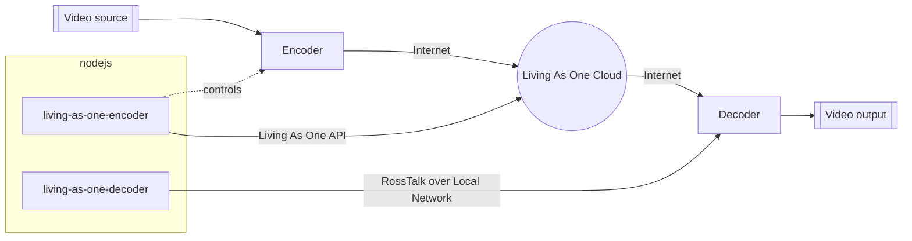
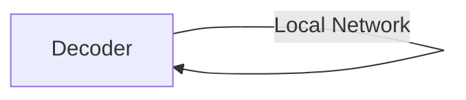

# Living As One Decoder

This library contains classes to control a Living As One decoder over the local network, using the Rosstalk protocol.  
To control any encoders, see [living-as-one-encoder](https://github.com/emptygalaxy/living-as-one-encoder).




## Installation

Install living-as-one-decoder with npm

```bash
  npm install living-as-one-decoder
```

## Features

- Play the video on the decoder
- Pause the video on the decoder


## Usage/Examples

```typescript
import {LivingAsOneDecoder} from 'living-as-one-decoder';

const decoderIP = '0.0.0.0';

const decoder = new LivingAsOneDecoder();
decoder.connect(decoderIP);

// pause after one second
setTimeout(() => {
  decoder.pause();
}, 1000);

// resume playing after two seconds
setTimeout(() => {
  decoder.play();
}, 2000);
```


